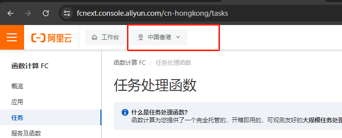
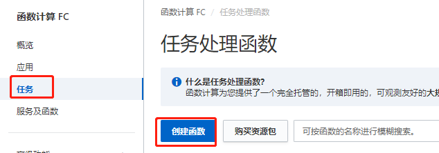
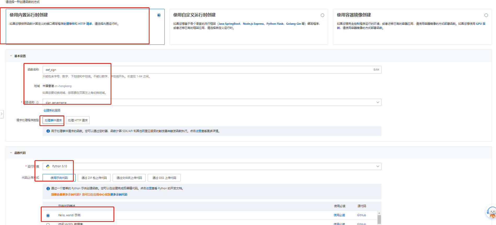
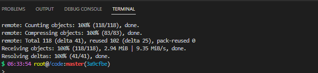
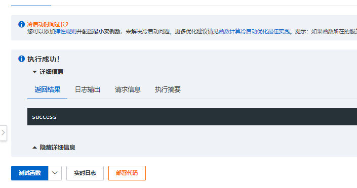
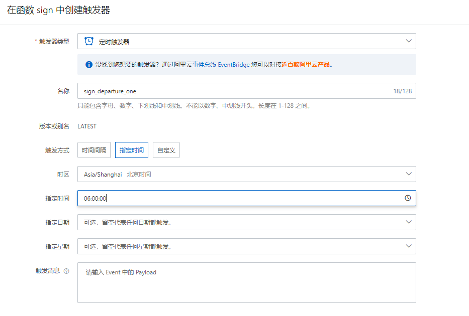
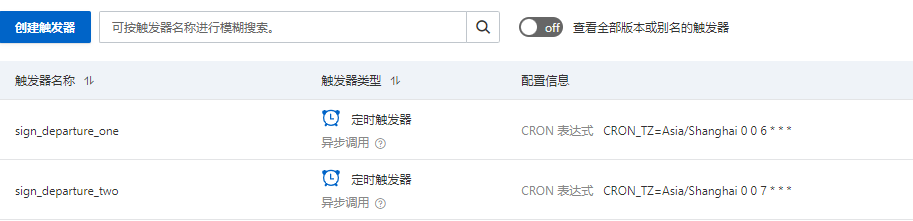

# Sign_in_script

>签到脚本

## 简单使用

目前支持的系统：t00ls、hostloc、ruike等

### 1、修改配置文件

将lib目录下的`config-debug.yaml`修改为`config.yaml`, 然后根据配置内容的注释进行填写就行

### 2、修改提醒脚本

同样是lib目录下的`notify - debug.py`修改为`notify.py`文件，根据脚本注释修改push_config的内容

### 3、修改主函数

在`Sign_in_script.py`中定义了四个模块，可以将不需要的模块注释掉

### 4、定时任务

```
cronta -e
表示在每天的1点执行任务，实际国内时间为9点(国外要注意VPS时差)
0 1 * * * /bin/bash /root/Sign_in_script/start.sh > /dev/null 2>&1
表示在每天的10点执行任务(国内)
0 10 * * * /bin/bash /root/Sign_in_script/start.sh > /dev/null 2>&1
```

## 布置到云函数

> 使用的是阿里云`函数计算FC`

1、设置区域



2、创建函数

在`任务`选项`创建函数`



按照图中选项即可，`函数名称`和`服务名称` 自定义



3、准备代码

下载到code目录
```
git clone https://github.com/s1g0day/Sign_in_script
```



```
# 进入目录
cd Sign_in_script

# 将所有文件复制到上级目录 code 内
cp -r * ../

# 删除项目
cd .. && rm -rf Sign_in_script*
```

4、配置

跟前面一样配置 `config.yaml` 和 `notify.py`

5、安装模块到当前目录

```
pip3 install -r requirement.txt -t .
```

6、部署测试

先 `部署代码` (相当于保存代码)，再 `测试函数`， 出现success表示成功



7、创建定时任务





创建了两个触发器，避免网络问题导致触发失败，并且这个触发器是第二天才生效的。